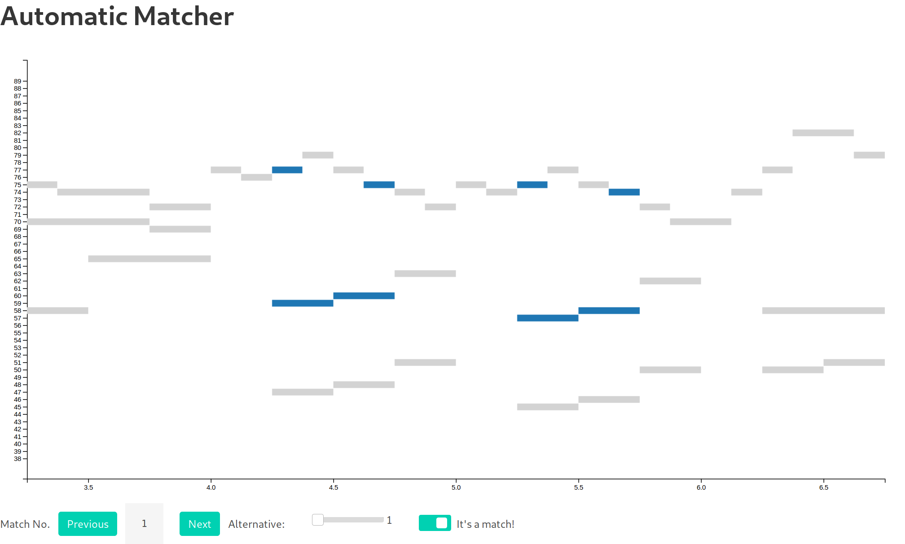
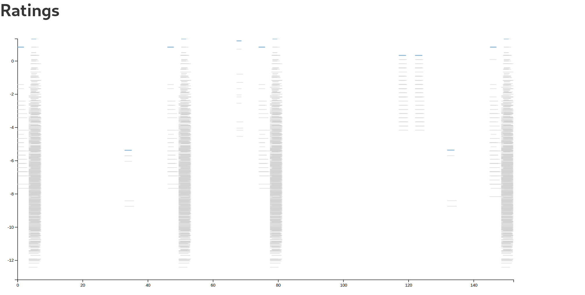
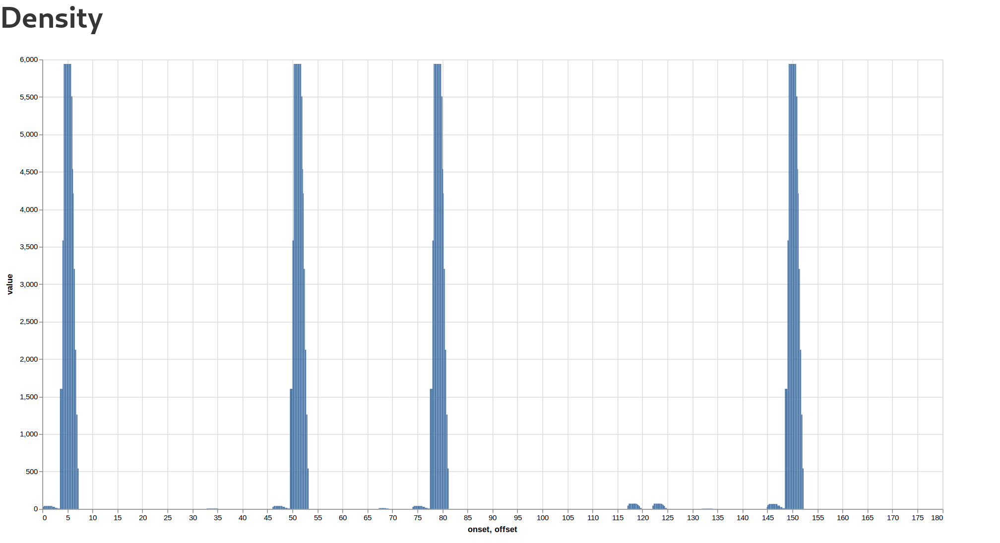
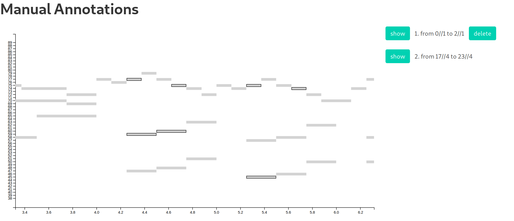

# Introduction

The goal of this project is to create a set of software tools for working
with voice-leading schemata in musical corpora.
Instances of specific schemata in pieces of music can be matched automatically,
the matches can be explored, and schema annotations can be created
by correcting and extending automatic matches.

Voice-leading schemata are musical patterns of a certain type,
which are easy to recognize but difficult to define.
As an approach to formalizing schemata,
this project implements an annotation method and a matcher for a working definition of schemata.
Under this definition, an instance of a schema is:
- a selection of notes in a piece that
- consist of stages and voices and
- follow a specific interval pattern.

This working definition is mostly concerned with schema instances
and does not refer to schema types or what inform us what kind of pattern schemata are.
However, it informs about some of the constraints that apply to instances of schemata
and thereby also constraint what schemata can be.
Note also that the approach of relating schema instances with specific interval patterns
is compatible with the idea that schema types (e.g., a Fonte) can be realized
as different interval patterns, as long as a rule can be given
by which concrete interval patterns can be derived from a schema type.

The approach presented here is concerned with two things:
1. Finding instances of a schema in a piece from an interval pattern ("matching").
2. Annotating schema instances in a corpus in order to evaluate and improve the matcher.
The software implemented in this project consists of a schema matcher,
as well as a web interface for exploring these matches and creating corrected annotations from them.
The implementation of these tools is described in detail in the following sections.

# Schema Matching using Polygrams

## Skipgrams

Schema instances are characterized by a specific variant of skipgrams.
Skipgrams are non-connected subsequences of objects from a longer sequence
that are not separated by more than a certain number of elements.
They are characterized by (a) the number of objects to be selected `n` and
(b) the "skip limit" `k`.
Usually, all skipgrams within a given sequence of objects
that oblige to these parameters are generated and can be used for further processing.

[Finkensiep, Neuwirth, and Rohrmeier (2018)](http://ismir2018.ircam.fr/doc/pdfs/202_Paper.pdf) showed
how to this idea can be generalized to arbitrary skip-distance measures.
This allows skipgrams to be applied to notes in a polyphonic piece,
where distances based on intermediate elements are not useful
but distance based on time intervals is.
In this context, a skipgram is a sequence of `n` notes selected from the piece.

The algorithm to enumerate these generalized skipgrams also allows
to apply a predicate to every prefix of a skipgram
in order to filter out unwanted instances as soon as possible.
Optionally the output can be sorted to be stable to the order of the input.
The function generating all such skipgrams can be notated as
```
skipgrams(input, n, k, f-skip, f-pred, [stable=false]).
```

## Polygrams

In order to reflect the *voices x stages* structure of schemata,
schema instances are represented as nested lists of notes,
where each stage is a list of notes (vertical structure), one for each voice,
and the whole schema is a list of such stages (horizontal structure).
A single instance of these structure is called a *polygram* (polyphonic skipgram).

Using the generalized skipgram algorithm,
all possible polygrams that meet some constraints can be enumerated in two steps.
First, all potential stages are enumerated by applying skipgrams on notes.
The skip function used here is the inter-onset interval (IOI) between two consecutive notes
in a stage.
The sum of these skips is bounded by the parameter `k`,
which was chosen to be the length of one bar in the piece.
(So far the assumption is made that the time signature doesn't change through the piece,
although several generalizations are possible that lift this constraint.)
```
stages = skipgrams(notes, n_voices, barlength, ioi-dist, constant-true, stable=true)
```

In the second step, all stages are combined into sequences, again using the skipgram algorithm.
In this case, the skip distance is a step function:
```
stage-dist(s1, s2) = 0 if ioi(first(s1), first(s2)) < barlength,
                     1 otherwise.
```
In other words, the distance between to stages is measured by the IOI
between the onsets of their respective earliest notes.
But instead of limiting the sum of these distances over the whole polygram,
this distance function limits the individual stage distances,
as just looking at the sum would allow a very uneven distribution of the stages.
This distance function requires the stages to be sorted by onset,
which is why the `stable` parameter is set in the first skipgram pass.
Furthermore, no stage is allowed to overlap the other stages in the skipgram in time.
```
polygrams = skipgrams(stages, n_stages, 0, stage-dist, no-overlap).
```

## Matching

In the current approach, schemata are characterized by interval patterns.
The description of interval patterns reflects the polygram structure:
Each pattern is encoded as nested lists of intervals with the same structure as polygrams,
i.e., lists of `n_s` stages, which are lists of `n_v` intervals.
As the transposition of a schema and the octaves of its notes are not known,
intervals are given relative to the first note in the lowest voice and in *interval classes*,
i.e., ignoring the octave (in semitone/MIDI representation between 0 and 11).
In order to disambiguate the voices,
the stages encode the voices from lowest to highest by convention.

Any polygram with `n_s` stages and `n_v` voices can now be compared to an interval pattern by
1. sorting the notes in each stage by pitch (lowest to highest)
2. transposing every pitch relative to the lowest note (bass) in the first stage
3. expressing the resulting intervals modulo one octave (e.g., mod 12).

Instead of first generating all polygrams and then filtering them for the right interval pattern,
the prefix predicate will be used to remove out non-matching structures as early as possible.
In the first pass, this means either comparing a prefix
to all possible interval patterns in incomplete stages
(since, e.g., the first and third voice could be selected first),
or comparing only finished stages to possible stage interval patterns.
In the second pass, prefixes of polygrams are compared to possible prefixes
in the interval representations of the schemata that should be matched.
Prefix matching can be efficiently implemented using finite state automata
to represent the lexicon (of stages or polygrams, resp.).
```
# either
stages = skipgrams(notes, n_voices, barlength, ioi-dist, is-stage-prefix, stable=true)
# or
stages = filter(is-stage, skipgrams(notes, n_voices, barlength, ioi-dist, constant-true, stable=true))

polygrams = skipgrams(stages, n_stages, 0, stage-dist, no-overlap ∧ is-poly-prefix).
```

# Selecting Matches using Heuristics

While the first part of the schema matcher returns all schema-like structures
of limited temporal range that match a schema's interval structure,
most matched polygrams are not actually schema instances, i.e., they are *false positives*.
These false positives arise for two reasons:
1. In the context of a true schema instance, the relevant notes are repeated
   or reoccur by chance.
2. A matching combination of notes occurs entirely by chance.
   This is especially likely when many notes occur within the chosen temporal limits.
In both cases, all possible combinations of notes must be considered,
leading to a combinatoric explosion, where most matching polygrams are false positives.

As the "true" criterion that distinguishes true from false positives is
(a) unknown and (b) probably difficult to evaluate,
a set of heuristics is used as a proxy for the "structuralness" of a polygram.
The general procedure consists of two steps:
1. The *score* of a polygram is determined as the weighted sum of a set of heuristics.
2. Combinatoric complexity is reduced by removing overlapping polygrams in favour
   of the polygram with the highest score.

## Heuristics and Score

The following heuristics are currently used to evaluate schema instances:
- the total duration of the notes in the polygram `Σₙ dur(n)`
- the total amount of "skip" in all stages,
  i.e., the time from the onset of the first to the onset of the last note
  `Σₛ onset(latest(s)) - onset(earliest(s))`
- the total number of semitones traveled within all voices
  `Σᵥ Σᵢ |pitch(poly[i,v]) - pitch(poly[i+1,v])|`.

Since these heuristics return numeric values,
the total score of a polygram can obtained by taking a weighted sum
of the heuristics' judgments of the polygram.
When a dataset marking true positive polygrams is available,
the weights can be fitted using a logistic regression,
maximizing the score of true positives while minimizing the score of false positives.

## Complexity Reduction

Using the score, the combinatoric explosion caused by repetition of notes can be reverted.
Whenever a polygram overlaps temporally with another polygrams,
the one with the lower score is removed.
If the heuristics are appropriate,
this will lead to the selection of only the true positive polygram of an actual schema instance
instead of any less good competitor caused by combination of parts of the true instance
and other notes with the appropriate pitches.

While this procedure eliminates false positives in competition with true positives,
it will keep the best polygrams in regions with only completely accidental instances.
It is unclear, if these can be reliably distinguished from false positives
within a stylistically homogeneous corpus by tuning the score function.
For a stylistically heterogeneous corpus this is very unlikely.

# Interactive Exploration and Annotation

A set of web-based interactive components for the schema matcher were created
that allow to visualize both individual polygrams in the context of the piece
as well as the distribution of polygrams in the piece.
Being created as `Interact.jl` widgets,
these components can be used in the context of Jupyter notebooks and IDEs such as Atom,
but can also be combined to larger, browser-based applications.
Two such applications have been built,
one for the exploration of interval-based schemata in  corpora,
the other one for the computer assisted annotation of these schemata.

## Exploration

The exploration application consists of three main parts.
In the first part, a visualization of the piece in "pianoroll" representation is shown
with the notes of a single matched polygram highlighted.
The user can browse through the results of the matcher (as described above)
by cycling through the best results from each region of overlap.
A separate slider allows to view alternative results from the current region of overlap.
Finally, a switch can be used to indicate whether the current region contains a schema instance.
The selected alternative and the state of the instance switch are remembered
when going to the next or previous region.



The second part contains an overview of the matching polygrams in the whole piece.
Each polygram is visualized by a horizontal line that spans from the onset to the offset
of the polygram it represents.
The line's vertical position represents the score of the polygram.
In addition, the polygrams selected as matches in the pianoroll view are highlighted
(respecting the selection of alternatives and non-instance regions).
This view allows simple identification of repeated instances and the structure of the piece
as well as comparison of the scores of competing polygrams or true and false positives.



Finally, the piece density of matching polygrams over the piece is visualized
in a histogram-like plot, that indicates for every time point in the piece the number of
matching polygrams that span over this time point.



## Annotation

The annotation application also consists of three parts.
The first part is the same as in the exploration application
and displays the results of the matcher in a pianoroll plot
while allowing to modify individual matches and deselect complete regions.
In this case, the selection is meant to be the correction of the annotator
over the suggestions of the automatic matcher.

True positives might be hard to find in the list of alternatives in the first plot,
and false negatives may occur as well (although in a very controlled way).
Therefore, the annotator can manually indicate schema instances in the second plot,
which also is a pianoroll plot but allows interactive selection of notes.
If the selection of notes made by the user  matches an interval pattern
that has been used by the matcher in the first plot,
the corresponding polygram is added to a list of manual annotations.
This list is shown next to the plot, and from it polygrams can be reviewed and deleted.



Finally, a third pianoroll plot combines the automatic (though moderated) matches
from the first and the manual matches from the second widget.
This allows the annotator to get an overview of all annotated matches and their origins.
A save button allows to store these combined annotations in a well-defined location.


